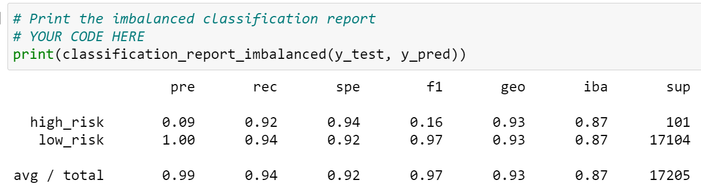

# Credit_Risk_Analysis

## **Objectives**

The objective of this project is to help a peer-to-peer lending services company, _Fast Lending_ assess credit risk of a loan application using machine learning. Using machine learning will provide a quicker and more reliable loan experience for the clients. The management of the company believes that using machine learning will lead to a more accurate identification of good candidates so that the loans will have less risk of default. A credit risk has an unbalanced classification with good loans outnumbering the risky ones. Most machine learning techniques will have a poor performance on the minority class, which is important to determine if the loan is risky.

 We used resampling and boosting models to make most of the data. We used six different algorithms and models to tackle the imbalance in the data: two oversampling (RandomOverSampler, SMOTE) of the minority class; one undersampling (ClusterCentroids) of the majority class; one over-under sampling (SMOTEENN); two machine learning models (BalancedRandomForestClassifer and EasyEnsembleClassifier) to predict credit risk outcome. The company will use the better machine learning predictor for credit risk analysis. We used machine learning environment, *sikit-learn* and _mlenv_  in Pandas using Jupyter notebook to run the program and do the analysis. 

## **Results**

We are given the dataset, *LoanStats_2019Q1.csv* from **LendingClub**, a peer-to-peer lending services company. The dataset contained 86 columns and 115,677 rows of records about clients. The columns contained *loan_amnt*, *home_ownership*, *annual_inc*, *loan_status*, *credit_limit*, etc. Among all the variables, *loan_status* is the dependent variable, since a client's credit worthiness (loan_status = low_risk or high risk) is dependent upon other information about the client (Fig 1). We classified the rest of the column information as the independent variables that a machine learning algorithm will use to predict the credit worthiness of a client. We split the target y (loan_status) and the features X (85 variables). A machine learning algorithm can only interpret numerical data. We created a DataFrame and then converted the categorical and text data columns into numerical values using *get_dummies* method. It split a columns value into a binary, 1 (when "true") and 0 (when "false"). The number of features columns increased fro 85 to 95 as a result this split. 

**Fig 1:** The image shows the original DataFrame before conversion of the data for machine learning algorithm.

The data is split into training (75%) and testing data (25%) (Fig 2). The shape of the data is shown Fig 2. 

**Fig 2:** The shape of the data showing a 75%, 25% split between training and testing sets. 

To train and validate our models we split the features and target sets into "train" and "test" sets. We scaled the data by oversampling the minority class and undersampled the majority class to reduce the bias in the prediction. We determined the validity of the model using the features and target testing sets. We split the scaled data into training and testing using *train_test_split* from *sklearn.model_selection*. We then (i) created a machine learning instance to fit the training data, (ii) made predictions; Evaluated the results by: (iii) checking the accuracy, (iv) constructed a confusion matrix and (v) got a classification report. We also used **logical regression**. The logical regression predicts a binary outcome. It might be able to decide whether to approve or deny a credit card application based on multiple variables (85 in our case). 

The diagonal cells of a **confusion matrix** makes correct prediction (TP = True Positive and TN = True Negative) as shown in Fig 3. An algorithm would make a better prediction if the relative values of TP and TN values are large. The **Classification Report** shows some important information, such as _Precision_, _Recall_ (also known as Sensitivity) and _F1 score_ (weighted average of the true positive rate and precision). The equation to calculate each is given below:

- Precision = TP/(TP + FP); A low precision is indicative of a large number of false positive.

- Recall = TP/(TP + FN); A low recall is indicative of a large number of false negatives.

- F1 score = 2*((Precision*Recall)/(Precision + Recall)); The best score is 1 and worst is 0. 

- Support: This is the number of actual occurrences of the class in the dataset. 

**Fig 3:** The image shows the predictions of four cells of a confusion matrix.

The summary of the results from each model is given below. 

### **1. Naive Random Oversampling Algorithm**

An oversampling algorithm samples a minority class until the minority training class is larger. For **random oversampling**, the minority class instances are randomly selected and added to the training set until the majority and the minority classes are balanced as shown in Fig 4. The resampled data is used in _Logistic Regression_ model. Figures 5, and 6 show the balanced accuracy score, confusion matrix and the classification report of this model.

**Fig 4:** Random Oversampling used to increase the minority class, "High Risk" training set.

**Fig 5:** Balanced accuracy and confusion matrix of the results after using random oversampling method.

**Fig 6:** Classification report of the results after using the random oversampling method.

### **2. SMOTE Oversampling**

The **Synthetic Minority Oversampling Technique (SMOTE)** is an oversampling approach that increases the minority class by interpolating new instances from closest neighbors. For an instance in a minority class, a number of its closest neighbors are chosen and new values are created based on the values of the neighbors. SMOTE is not good at handling the outliers since it will generate synthetic data near the outliers. Figures 7, 8 and 9 shows the y-Counter, the balanced accuracy and confusion matrix, and classification report.

**Fig 7:** SMOTE oversampling used to increase the minority class, "High Risk" training set. 

**Fig 8:** Balanced accuracy score and confusion matrix generated from the resampled data after using SMOTE.

**Fig 9:** Classification Report of the resampled data after using SMOTE oversampling technique. 

### 3. **Cluster Centroid Undersampling**

A **Cluster Centroid Undersampling** algorithm identifies the majority class, then generates synthetic data points called _centroids_ that are representative of the data cluster. The majority class is undersampled down to the minority class. The results of the resampled data are shown in Figures 10, 11 and 12.

**Fig 10:** The y-resampled counter after performing ClusterCentroid undersampling.

 

**Fig 11:** Balanced accuracy score and confusion matrix generated from the resampled data after using ClusterCentroid undersampling. 

**Fig 12:** The classification report generated after using ClusterCentroid undersampling technique. 

### **4. SMOTEENN (Combination of Over and Under Sampling)**

The SMOTEENN method combines the SMOTE and Edited Nearest Neighbors (ENN) algorithms. It is a two step process: (1) Oversample the minority class using SMOTE; (2) Clean the resulting data with an undersampling strategy. For example, if two nearest neighbors of data points belong to two different classes, that data point is dropped. This method makes a cleaner separation of the majority and minority classes. Figures 13, 14 and 15 shows the y-resampled counter, balanced accuracy and confusion matrix, and classification report. 

**Fig 13:** The y-resampled counter after using SMOTEENN algorithm.

 

**Fig 14:** Balanced accuracy score and confusion matrix generated from the resampled data after using SMOTEENN method. 

**Fig 15:** The classification report generated after using SMOTEENN method.

### 5. **Balanced Random Forest Classifier**

An ensemble learning process combines multiple algorithms. A _random forest classifier_ samples the data and builds several smaller, simpler decision trees. Each decision tree is built from a random subset of the features. Each tree is a weak learner since it is built using a small portion of data. However, when combined together the model has a much better decision making power. A **balanced random forest classifier** randomly under-samples each boostrap sample to balance it. A _boostrapping_ is a sampling technique that samples instances a number of times, and each sampling may occur multiple times. Figures 16, 17 and 18 shows the result of y_train counter, balanced accuracy score and confusion matrix, and imbalanced classification report. Figure 19 shows a dataframe showing the features sorted in descending order by features. Note that the "importance" values matches with the challenge example, but the features names do not. This needs further investigation. 

**Fig 16:** The image shows y_train counter after using Balanced Random Forest Classifier. 

 

**Fig 17:** The image shows the accuracy and confusion matrix after using Balanced Random Forest Classifier. 

**Fig 18:** The imbalanced classification report generated after using Balanced Random Forest Classifier. 

 

**Fig 19:** The images show a dataframe of features sorted in descending order by feature importance.

### **6. Easy Ensemble AdaBoost Classifier**

An Adaptive Boosting (AdaBoost) is an estimator that trains a model and then evaluates it. After evaluating the errors in the first model, another model is trained. The errors of the previous model gets extra weight to minimize errors in the subsequent models. The process is repeated until the error rate is minimized.
Figures 20 and 21 shows the accuracy and confusion matrix, and classification report. 

 

**Fig 20:** The image shows the accuracy and confusion matrix after using Easy Ensemble AdaBoost Classifier.

**Fig 21:** The imbalanced classification report generated after usingEasy Ensemble AdaBoost Classifier.

## **Summary**

The goal of this analysis was to compare six methods of sampling data, fitting it to different models and predicting an outcome of credit worthiness of clients using machine learning. The precision value for all the methods give low risk 1.0. It is not a good predictor for the deciding the credit worthiness. The sensitivity (recall) value is more important since it gives a better prediction about a loan application is risky or not. The summary of the results is given below:

- **Oversampling of the minority class :**  The Random Oversampling and SMOTE both gave an accuracy of about 0.65. The recall value for high risk (HR) is 0.60 and for low risk (LR) the recall value is 0.69 for Random Oversampling. The recall value for HR is 0.63 and LR is 0.69 for SMOTE. The recall values have slight variation, but it is not very different to choose one method over the other. 

- **Undersampling of the majority class :** The Cluster Centroid method of undersampling resulted in an accuracy score of 0.54. The recall value for HR is 0.69 and LR is 0.40. The predictions made by this method is less reliable. 

- **Over and under sampling method :** The SMOTEENN method gave an accuracy score of 0.64. The recall value of HR is 0.72 and LR is 0.57. While this method is better than undersampling, it does not do much better than the oversampling methods. 

- **Ensemble classifiers :** The Balanced Random Forest Ensemble Classifier had an accuracy score of 0.79. The recall value is 0.69 for HR and 0.60 for LR. The accuracy of Easy Ensemble AdaBoost Classifier (EEA) had an accuracy of 0.93. The recall values are 0.92 for HR and 0.94 for LR. 

Comparing all six methods listed above, the undersampling method is most unreliable since it rejects many records of the majority class that could be important. The Easy Ensemble AdaBoost (EEA) classifier gives the best prediction for high risk and low risk. This makes sense since the model adapts the training based on errors made in previous predictions. The F1 score of all the methods confirms that the EEA is the most reliable method of predicting a credit risk of the six methods tested for this analysis. 

